<p align="center">
  <a href="https://brainnetwork.app"></a>
</p>

<p align="center">
  <a href="https://brainnetwork.app/network"></a>
  <a href="https://brainnetwork.app/explorer"></a>
  <a href="https://brainnetwork.app/explorer"></a>
  
  
  <a href="https://x.com/useBrainnetwork"></a>
</p>

<p align="center">
  <a href="https://brainnetwork.app/chat"><b>Use BRAIN</b></a> ·
  <a href="https://brainnetwork.app/earn"><b>Power BRAIN</b></a> ·
  <a href="https://brainnetwork.app/developers">API</a> ·
  <a href="https://brainnetwork.app/pricing">Pricing</a> ·
  <a href="https://brainnetwork.app/network">Network</a> ·
  <a href="https://brainnetwork.app/economics">Economics</a> ·
  <a href="https://x.com/useBrainnetwork">X</a>
</p>


**BRAIN** is a distributed AI compute network. Requests are routed by BRAIN AUTO across browser compute, native GPUs, operator cloud and external models to the cheapest path that meets their constraints, and every response carries a receipt showing how it ran. The same network is powered by ordinary computers: open a tab, the server measures and verifies your WebGPU compute, and verified work offsets what you use. Developers get the same engine through an OpenAI-compatible API.

Live at [brainnetwork.app](https://brainnetwork.app). Every figure on the site and in this README carries its provenance; the design rules are in [REAL_VS_SIMULATED.md](REAL_VS_SIMULATED.md).


## Quickstart

### Use it

```bash
curl https://brainnetwork.app/v1/chat/completions \
  -H "Content-Type: application/json" \
  -d '{
    "model": "brain/auto",
    "mode": "CHEAP",
    "messages": [{ "role": "user", "content": "explain entropy in one line" }]
  }'
```

Same wire format as the OpenAI API, so existing SDKs work by changing `base_url`. Set `stream: true` for SSE. Optional fields: `mode` (`AUTO` · `CHEAP` · `FAST` · `QUALITY` · `BROWSER_ONLY`), `privacy` (`PUBLIC` · `STANDARD` · `PRIVATE`), `maxCost` (USD), `maxLatency` (ms).

Every response carries a `brain` object and an `x-brain-receipt` header. Streams end with `event: brain` before `data: [DONE]`.

```json
"brain": {
  "mode": "CHEAP",
  "privacy": "STANDARD",
  "target": "EXTERNAL_MODEL",
  "provider": "external",
  "model": "meta-llama/llama-3.1-8b-instruct",
  "nodesUsed": 0,
  "latencyMs": 874,
  "cost": { "amount": 0.000003, "currency": "USD", "basis": "list-price" },
  "verification": "unverified-provider-response",
  "verified": false,
  "receiptId": "r-c-muuhiedx-pxal"
}
```

If nothing can run the request, you get `503 no_provider_available` with every target's exclusion reason. BRAIN never answers from a target it did not select.

### Power it

Open [brainnetwork.app/earn](https://brainnetwork.app/earn) in Chrome, Edge, Safari 26+ or Firefox 141+ (Windows) and press **Join network**. Nothing is installed. Your GPU is benchmarked by the server, joins the pool, and receives verified work. Verified work earns credits you can spend on BRAIN today, and USDC or SOL to your Solana wallet when payouts are enabled. [/node](https://brainnetwork.app/node) is the full-screen worker; [/demo](https://brainnetwork.app/demo) runs a job across every device in the room.

### Run it

```bash
git clone https://github.com/UseBrainNetwork/brain && cd brain
npm install
npm run dev          # http://localhost:3000
npm test             # 102 tests
npm run typecheck && npm run build
```

Node 20+. With no configuration the app runs on an in-memory store and the inference API returns an honest `503`. Copy `.env.example` to `.env.local` to configure a provider, prices or Postgres. Every variable is server-only except `NEXT_PUBLIC_BRAIN_WS_URL`. The full table is in [the environment reference](#environment) below.


## How a request runs

<p align="center"></p>

```
REQUEST → CLASSIFY → PLAN → ESTIMATE → SELECT → EXECUTE → VERIFY → MERGE → RESPONSE → RECEIPT → LEARN
```

| Stage | What happens | Code |
| --- | --- | --- |
| Gateway | Account or API key, plan rate limit, schema validation | `api/gateway.ts`, `app/api/chat`, `app/api/v1` |
| Classify · Plan | Capability, whether the request carries plaintext, a single-step plan (compound DAG plans supported) | `engine/plan.ts` |
| Estimate | Each resource class returns cost, latency, reliability, capacity, model, quality tier and the basis for each. Unmeasured = `UNKNOWN`, never guessed | `engine/providers.ts` |
| Select | Hard constraints (supported, available, privacy, budget) then a published weighted score per mode | `engine/router.ts` |
| Execute | Selected provider runs it; fallback to the next eligible target if it fails before the first byte | `engine/orders.ts` |
| Verify | Browser-network work is spot-checked against secret rows or a canary; upstream model output is marked unverified | `services/verification.ts` |
| Response · Receipt | OpenAI-shaped response or reframed stream; `ComputeReceipt` with route, cost, verification; credits consumed; accounting accrued | `api/chatStream.ts`, `services/receipts.ts` |

Routing weights, the privacy matrix and fallback semantics: [ROUTING.md](ROUTING.md). Components and data flow: [BRAIN_ARCHITECTURE.md](BRAIN_ARCHITECTURE.md).

### Resource classes

| Class | Trust | Today |
| --- | --- | --- |
| `BROWSER_NETWORK` | untrusted, verified | Live. WebGPU nodes run integer kernels verified bit-exactly by the server |
| `NATIVE_NETWORK` | untrusted, verified | Roadmap: native GPU clients |
| `CLOUD_GPU` | operator | Available when `BRAIN_FALLBACK_*` is configured |
| `EXTERNAL_MODEL` | third-party | Live. Provider-reported cost is recorded per request |


## Security model

Contributors are assumed adversarial. The server does not trust any client-reported GPU model, compute units, job completion, benchmark score or uptime.

- **Benchmark** is the server's clock between issuing a seeded challenge and receiving a verified answer. Scores drive placement; the GPU name is display-only.
- **Completion** counts only after a canary or secret spot-check passes within plausibility bounds. Expected outputs and sampled indices never leave the server. Kernels are integer, so verification is bit-exact.
- **Reputation** is an EWMA where failures weigh double; nodes below 0.35 are banned. **Uptime** comes from server-received heartbeats.
- **Secrets** live in server env only. Upstream vendor fields and prices are stripped from streamed chunks. Session and API-key material is stored as hashes. Public pages show 4-hex node ids, never wallets, IPs or device names; public order endpoints carry no prompts or outputs.
- **Wallets** prove ownership by signing a server nonce (ed25519).

Report a vulnerability: [SECURITY.md](SECURITY.md).


## Economics

One subscription, one ledger. A **BRAIN credit** is a unit of real cost (`1 credit = $0.001`), consumed from each receipt's list price. Plans: Free (500 credits/month), Pro and Max. Verified compute from nodes your wallet powers is credited to your account and offsets what you use.

Contributor rewards (`rewards/engine.ts`):

```
weight_i = verifiedCompute_i × min(1 + α·ln(1 + normalizedHoldings_i), M) × reputation_i × reliability_i
share_i  = weight_i / Σ weight, water-filled under a per-account cap
```

Protocol wallet (creator fees land here, read on-chain at `/economics` and `/rewards`): `HZLev74M3ATV5jQJsoN8FcJAKx3RUefAobhcXr3egxwa`. The server never holds its key.

Tested properties: zero verified compute earns zero regardless of holdings; the holding multiplier is capped (1.35×) and concave, so splitting compute across sybil nodes gains nothing; no account exceeds the pool cap; allocations never exceed the pool. No emissions, no staking yield, no projected returns. Prices, splits and how list prices were derived: [ECONOMICS.md](ECONOMICS.md).


## Repository

```
app/          Next.js routes (pages + /api handlers)
components/   UI by page; components/ui.tsx holds primitives
domain/       Shared types: ExecutionRequest, ExecutionEstimate, ComputeReceipt, ComputeNode, …
engine/       BRAIN AUTO: providers, router, plan, orders (streaming + fallback), learning
api/          Gateway (validation, reframed streams, API keys), chat event stream
services/     Server: nodes, distributed jobs, verification, reputation, receipts, accounting,
              accounts, credits, capability, store (memory | Postgres), event bus, mock/
webgpu/       Browser: device detection, WGSL kernels, ComputeBackend, benchmark
network/      Deterministic workloads, contributor engine, realtime sources
rewards/      Reward formula and engine, config, simulator
providers/    OpenAI-compatible upstream client
lib/          Non-secret config, plans, pricing, formatting, wallet adapters
db/           Postgres schema (self-applied on first connection)
scripts/      Headless-Chrome e2e with real WebGPU, screenshots, mock upstream
```

<details>
<summary><b>Pages</b></summary>

| Route | What it is |
| --- | --- |
| `/` | Use BRAIN / Power BRAIN, live metrics strip, resource classes, network panel |
| `/chat` | Streaming chat through BRAIN AUTO; "Powered by BRAIN" expands to route, model, nodes, cost, latency, verification, receipt |
| `/pricing` · `/account` | Plans and credits; your plan, usage, compute earnings, net, credit ledger |
| `/earn` · `/node` · `/demo` | Contributor flow, full-screen worker, multi-device room |
| `/developers` | Quickstart (Python / JS / cURL), request path, routing, response format, node protocol, verification |
| `/auto` | Routing console: every resource class estimated for one request, decision, receipt |
| `/network` · `/explorer` · `/capacity` · `/economics` | Operations, jobs and nodes, what can run today, where the money goes |
| `/receipt/[id]` · `/node/[id]` · `/epoch/[id]` | Proof-of-compute receipt, node reputation, immutable reward epoch |
| `/rewards` · `/brain` | Reward formula and claims; the network as one machine |

</details>

<details>
<summary><b>Contributor protocol</b></summary>

```
browser                                         server
───────                                         ──────
detectDevice()  adapter.info, limits, WebGL renderer, navigator.*
                every field tagged with its source; unknowns = "unavailable"
probeThroughput() ── hint ──────────────────▶  POST /api/benchmark/challenge
                                                 issues mix_u32 spec, secret seed,
                                                 rounds sized to ~400 ms. Clock starts.
run WGSL kernel  ── block hashes ───────────▶  POST /api/nodes/register
                                                 recompute 3 secret blocks on CPU
                                                 score = ops / server-measured seconds / 1e7
JOIN NETWORK     ───────────────────────────▶  POST /api/nodes/join → node.joined event
loop:            ───────────────────────────▶  POST /api/jobs/next   (seeded spec only)
  run kernel     ── row/block hashes ───────▶  POST /api/jobs/result
                                                 canary (full answer) or secret spot-check,
                                                 plausibility bound, reputation EWMA,
                                                 compute credited, job.completed event
heartbeat 5 s    ───────────────────────────▶  POST /api/nodes/heartbeat (offline after 20 s)
```

</details>

<details id="environment">
<summary><b>Environment</b></summary>

| Variable | Effect |
| --- | --- |
| `BRAIN_EXTERNAL_BASE_URL` / `_API_KEY` / `_MODEL` | OpenAI-compatible external provider (`EXTERNAL_MODEL`) |
| `BRAIN_FALLBACK_BASE_URL` / `_API_KEY` / `_MODEL` | Operator cloud (`CLOUD_GPU`), e.g. vLLM |
| `BRAIN_EXTERNAL_QUALITY_TIER` / `BRAIN_FALLBACK_QUALITY_TIER` | Operator-assigned 0..1 tier used by `QUALITY` mode. Unset = UNKNOWN |
| `BRAIN_API_KEYS` | Comma-separated keys required on `/v1/*`. Empty = open but rate limited |
| `DATABASE_URL` (or `POSTGRES_URL`) | Postgres instead of the in-memory store; schema self-applied; advisory-locked job updates |
| `BRAIN_PRICE_USD_PER_1K_COMPUTE_UNITS` | List price for browser compute. Unset = receipts carry `UNKNOWN` cost |
| `BRAIN_PRICE_USD_PER_1M_TOKENS` / `BRAIN_FALLBACK_PRICE_USD_PER_1M` / `BRAIN_EXTERNAL_PRICE_USD_PER_1M` | Chat list price and each upstream's cost. Unset = `UNKNOWN`, never estimated |
| `BRAIN_EXTERNAL_EMBED_MODEL` | Enables `/v1/embeddings` passthrough |
| `BRAIN_CREDIT_USD`, `BRAIN_PLAN_FREE_CREDITS`, `BRAIN_PLAN_PRO_USD` / `_CREDITS`, `BRAIN_PLAN_MAX_USD` / `_CREDITS` | Credit value and plan allowances |
| `SOLANA_RPC_URL` + `BRAIN_TOKEN_MINT` | Real SPL holdings lookup. The protocol-wallet read falls back to the public RPC when unset |
| `BRAIN_SERVER_SECRET` | HMAC key for sessions and claims. Required in production |
| `BRAIN_ADMIN_TOKEN` · `BRAIN_DEMO_TOKEN` | Operator routes · optional gate on console job/order creation |
| `BRAIN_PAYOUTS_ENABLED` + `BRAIN_PAYOUT_SECRET_KEY` | SOL claim payouts. Off by default |
| `NEXT_PUBLIC_BRAIN_WS_URL` | External WebSocket event bus (default: built-in SSE) |

Exercise the inference path without a real provider:

```bash
node scripts/mock-upstream.mjs 3999
BRAIN_EXTERNAL_BASE_URL=http://localhost:3999/v1 BRAIN_EXTERNAL_API_KEY=test BRAIN_EXTERNAL_MODEL=mock npm run dev
```

</details>


## Documentation

| | |
| --- | --- |
| [BRAIN_ARCHITECTURE.md](BRAIN_ARCHITECTURE.md) | BRAIN · NETWORK · AUTO · POWER BRAIN · RECEIPT; request flow, resource classes, privacy, accounts and credits |
| [ROUTING.md](ROUTING.md) | Estimation, constraints, published weights per mode, fallback |
| [ARCHITECTURE.md](ARCHITECTURE.md) | Modules, data flow, store and locking, event bus |
| [ECONOMICS.md](ECONOMICS.md) | Pricing config, plans and credits, pay with compute, splits |
| [REAL_VS_SIMULATED.md](REAL_VS_SIMULATED.md) | Provenance of every number and the rule that they are never mixed |
| [CURRENT_STATE.md](CURRENT_STATE.md) | Audit and current status |
| [NEXT_30_DAYS.md](NEXT_30_DAYS.md) | Validation-first plan |
| [CONTRIBUTING.md](CONTRIBUTING.md) · [SECURITY.md](SECURITY.md) | How to contribute · how to report |

## Principles

- Nothing client-reported is trusted. Only server-verified compute earns.
- Unknown is a valid value. Prices, latencies and hardware are measured or configured, never estimated.
- Real and simulated records never share a total. The site is real-only by default; demo data lives in `services/mock/`, appears only behind the footer's "Show simulated data" button, and is labelled SIM.
- No token emissions, staking yield, points, quests, licenses, NFTs, projected returns or "cheaper than X" claims.

## Community

[@useBrainnetwork](https://x.com/useBrainnetwork) on X · [github.com/UseBrainNetwork](https://github.com/UseBrainNetwork)

## License

© Brain Network. All rights reserved.
