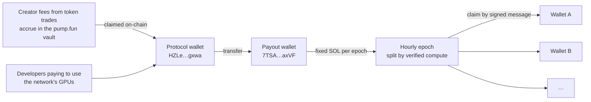

# How contributors are paid

One rule, stated plainly: **every hour, a fixed amount of SOL is split among the wallets that did verified work in that hour, in proportion to how much verified work they did, adjusted for quality.** Nothing else moves it.

## The epoch

An epoch is one hour, aligned to the clock. Two minutes after each hour closes, a cron settles it:

1. Aggregate every job record in the window per wallet: verified compute units, jobs assigned and completed, availability (5-minute buckets with an assigned job, out of 12), verification pass rate.
2. Run the [reward formula](the-reward-formula.md) over those inputs with the epoch's pool.
3. Write the epoch once, with a hash of its allocations. Re-settling returns the stored epoch.

Each wallet's allocation becomes claimable immediately.

## The pool

The pool is a **fixed amount of SOL per epoch**, set by the operator (`BRAIN_EPOCH_POOL_SOL`). It is not a share of fees, not a percentage of anything, not derived from a price. The current amount is always shown live on [/economics](https://brainnetwork.app/economics), together with how many epochs the payout wallet can fund at that rate. The operator raises it as funding grows; this book deliberately does not print a number, because the live page is the only place it is true.

If the setting is absent, nothing live is settled. The pool never falls back to an estimate.

## Where the SOL comes from

Two sources feed the payout wallet.

**Creator fees.** Trading the BRAIN token on pump.fun generates creator fees, which accrue in a vault. The operator claims them on-chain to the protocol wallet and moves SOL from there to the payout wallet. All three steps are ordinary Solana transactions you can read on any explorer; the [treasury page](treasury-and-runway.md) explains how BRAIN reads them back.

**People using the GPUs.** Developers who send work to the network, through the API or the chat, pay for the compute they consume, and that revenue goes to the same payout wallet. Every receipt already records the customer-funded amount each node earned, so the figure is tracked per job and per node ([pricing and credits](pricing-and-credits.md)). Paid plans are bought on Solana and paid straight into that wallet; as usage grows this becomes the larger of the two sources, which is the point: the people powering the network are paid by the people using it.

## What counts as verified work

| Tier | Unit |
| --- | --- |
| Browser `matmul_u32` | Integer operations in the unit, counted only when the spot-check passes |
| Network inference stage | `parameters × tokens ÷ 2²⁰`, counted only when the replica agrees |
| GPU-node inference | `parameters × tokens ÷ 2²⁰`, tokens clipped to what the coordinator streamed, counted only for `COMPLETED` customer jobs after the wallet is proven |

Not counted: benchmarks, canaries, shadow re-runs, mock models, units lost to a deadline or a vanished node, units in a replica dispute, anything a client reported but the server did not verify.

## Claiming

On [/rewards](https://brainnetwork.app/rewards), connect the wallet that did the work and sign a message. The message binds the address, the amount in lamports, a single-use nonce and an expiry with an HMAC. The server re-checks the balance with the claim counted, allows one pending claim per wallet, enforces per-claim and 24-hour caps, and sends a SOL transfer from the payout wallet. The transaction signature is stored on the claim and shown to you.

Payouts are off unless `BRAIN_PAYOUTS_ENABLED=true` and a payout key are set. They have been on since launch.

## What has actually been paid

As of 7 October 2026, 19:25 UTC: **11.10 SOL** claimed by contributors across the epochs since launch, 14.09 SOL allocated in total, 2.99 SOL allocated but not yet claimed. Live figures: [/economics](https://brainnetwork.app/economics) and [`/api/treasury`](https://brainnetwork.app/api/treasury).

## Tokens and the multiplier

Holding BRAIN tokens in the wallet that does the work raises that wallet's weight by up to 1.35×, with diminishing returns and a cap at 1 % of supply. It is a multiplier on verified compute, so it multiplies zero into zero: a wallet full of tokens that did no work gets nothing. The maths is in [The reward formula](the-reward-formula.md). Holdings are read by RPC from the chain when configured and never self-reported.

## What this is not

Not staking: there is no return on holding. Not mining: there is no emission schedule, and the pool is funded from fees already earned. Not a promise: the operator can set the pool to any value including zero, the fee flow depends on trading volume BRAIN does not control, and the runway on `/economics` is the honest statement of how long the current wallet lasts.
