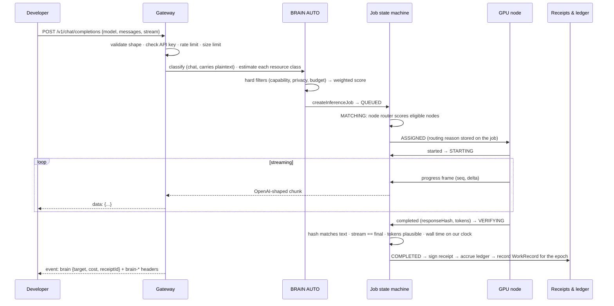

# A request's journey

What happens between `POST /v1/chat/completions` and the last byte of the answer. This is the GPU-node path; browser-network and upstream paths differ only in the middle.

## Step by step

**1. Validation.** The gateway checks the request against the OpenAI schema. Roles, sizes and tool schemas are bounded; image parts are rejected rather than silently dropped. The API key (`brain_sk_…`) is looked up by its sha256. Per-IP fixed-window rate limits apply.

**2. Classification.** `classify()` decides what capability the request needs (`chat`, `embeddings`, `compute.matmul_u32`), whether it carries plaintext a node operator could read (chat does), and a size hint.

**3. Estimation.** Each resource class answers independently and never sees the others' numbers: is it supported, is it available right now, estimated cost, estimated latency (median of measured samples), estimated reliability, capacity, confidence. Anything unmeasured is `null`, rendered **UNKNOWN**, and penalised in scoring.

**4. Hard constraints.** Applied before scoring and never traded against it: supported and available; `BROWSER_ONLY` mode; privacy (a `STANDARD` or `PRIVATE` request cannot go to hardware BRAIN does not operate); `maxCost` and `maxLatency` when the estimate is known. Each exclusion keeps its reason, which comes back to you on a `503` if nothing survives.

**5. Resource-class score.** Weighted over cost, latency, reliability and quality, with weights per mode (`AUTO`, `CHEAP`, `FAST`, `QUALITY`). Published in `ROUTING.md`.

**6. Node selection.** Inside the GPU-node class, the node router filters (online or busy with a free slot, serves the model, reported VRAM at least the requirement, region match if required, ask within budget) and scores `0.30·capability + 0.25·availability + 0.15·latency + 0.20·reputation + 0.10·price`. The winning score and the reason are written onto the job's history. See [Routing](routing.md).

**7. Execution.** The node's long-poll returns the job. It posts `started`, then streamed `progress` frames with sequence numbers, then `completed` with a hash of the full response. Timeouts: start within 20 s, progress within 60 s, hard deadline per job. A cold vLLM start gets 240 s to load weights before its first job is given up on.

**8. Verification.** The coordinator checks the response hash against the text it received, that the streamed text equals the final text, that the token count is plausible for the output length, and wall time on its own clock. It does not re-execute the model, so the receipt says `node-reported`. Separately, 5 % of deterministic jobs are re-run on a second node and compared. See [Verification](verification.md).

**9. Receipt and ledger.** The canonical receipt body is hashed and signed with the coordinator's ed25519 key. If a list price is configured, the accounting ledger accrues `COMPUTE_PROVIDER_EARNED` for the node; otherwise cost is **UNKNOWN**. The job also becomes a `WorkRecord` in the current hourly epoch, with units `parameters × tokens ÷ 2²⁰`, tokens clipped to what the coordinator streamed.

**10. Response.** You receive OpenAI-shaped chunks as they arrive, then a closing `event: brain` with the route, cost and receipt id, plus headers `brain-request-id`, `brain-target`, `brain-latency`, `x-brain-receipt`, `brain-node-id`, `brain-region`.

## What you never get

An answer from a target BRAIN did not select. If the chosen node fails before the first byte, the request can fall back inside the rules; if nothing can run it, you get `503` with every target's exclusion reason. BRAIN does not quietly substitute an upstream model for a node model: that is a `400 privacy_conflict` or a `503`, never a silent swap.
