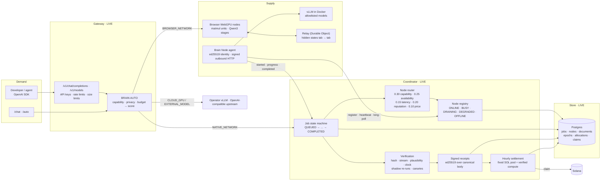

# Architecture

BRAIN is a Next.js application deployed on serverless functions, a Postgres database, a Cloudflare Durable Object relay for browser-to-browser inference, and the Solana chain for payouts. There is no long-running process; everything that looks like a scheduler is driven by incoming requests and one hourly cron.

## Components

| Component | Where | Status |
| --- | --- | --- |
| Gateway: validates OpenAI-shaped requests, checks API keys (stored as sha256), rate limits, adds `brain-*` headers | `app/api/v1/*`, `api/gateway.ts` | LIVE |
| BRAIN AUTO: picks a resource class (browser network, GPU nodes, operator cloud, external model) by hard filters then weighted score | `engine/router.ts` | LIVE |
| Node registry: derives node state server-side from heartbeats and outcomes; refuses mock nodes in production | `services/coordinator/registry.ts` | LIVE |
| Node router: pure, deterministic scoring with named rejections | `services/router/score.ts` | LIVE |
| Job state machine with timestamped history | `services/coordinator/jobs.ts` | LIVE |
| Benchmark on join, canaries, sampled redundant execution | `services/coordinator/benchmark.ts`, `verify.ts` | LIVE |
| Signed receipts; public key at `/api/coordinator/signer` | `services/coordinator/receipts.ts` | LIVE |
| Browser node lifecycle: detect, challenge, benchmark, join, heartbeat, offline sweep | `services/nodes.ts`, `webgpu/*` | LIVE |
| Distributed jobs: 64-unit integer matmul split across tabs, spot-checked, reassigned on loss | `services/distributed.ts` | LIVE |
| Network inference: pipeline-sharded Qwen3 across tabs with replica agreement | `inference/`, `relay/`, `webgpu/llm.ts` | LIVE, free |
| Hourly settlement into a fixed SOL pool; claims by signed message | `services/settlement.ts`, `services/claims.ts`, `services/payouts.ts` | LIVE |
| Treasury rebuilt from chain history | `services/treasury.ts` | LIVE |
| Accounting ledger of REAL and SIMULATED events, never mixed | `services/accounting.ts` | LIVE |
| Fail-soft store: circuit breaker, stale-body fallback, pooler-rejection retry | `services/failsoft.ts`, `services/pgStore.ts` | LIVE |
| Receipt anchoring on Solana, hardware attestation, full re-execution | — | PLANNED |

## Three clocks, one of them trusted

Everything that matters is timed by the coordinator. A node's own timing is recorded as telemetry and ignored for pay. A browser's timing is ignored entirely; the server times the challenge round trip. This is why benchmark scores are not TFLOPS figures: they are "how long did this fixed job take on our clock", which is the only number the coordinator can stand behind.

## No daemon

Because the coordinator runs on serverless functions, there is nothing that "runs in the background" in the usual sense. Node polls are the network's clock: each poll that finds no work gives the scheduler a chance to dispatch a baseline job, each heartbeat updates derived state, and a single cron at two minutes past the hour settles the epoch that just closed. The upside is that the control plane costs almost nothing and scales with traffic. The downside is a class of bugs described in [When the database goes away](failing-soft.md).
