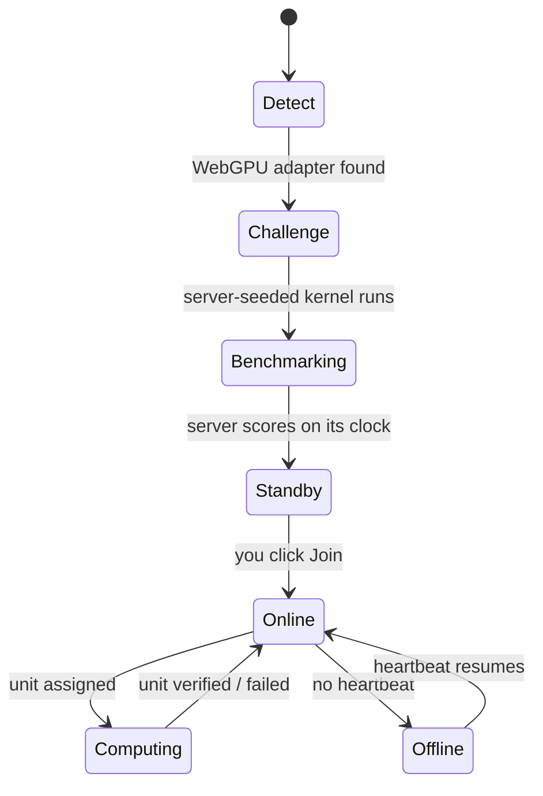

# Browser nodes

A browser node is a tab on [brainnetwork.app/earn](https://brainnetwork.app/earn). Nothing is installed. The whole lifecycle runs in that tab against the server, and every step of it is real.

## Detect

`navigator.gpu.requestAdapter()`, `adapter.info`, limits and features, plus the WebGL unmasked renderer and `navigator.*` fields. Each field carries its source. Anything the browser does not expose is shown as *unavailable*, never guessed. VRAM is always unavailable, because no browser exposes it. The device class (M4 Max, RTX 4090, "other WebGPU") comes from the adapter string and is for display only.

The adapter's maximum buffer size is recorded, and half of it becomes `advertisedMemoryGb`: the pool memory BRAIN is willing to schedule against. On the live network this averages 0.9 GB per tab.

## Challenge and benchmark

The server issues a secret-seeded challenge. The tab runs a WGSL integer kernel (`mix_u32`) on the GPU and returns the result. The server recomputes secret blocks, checks them, and scores the node on its own clock. The score is not a TFLOPS figure and the client's own timing is ignored. The node is registered on standby.

## Join

Clicking Join flips the node to online. The join counter on the site increments by exactly your node, and the `NODE xxxx JOINED` event comes from the server's event bus over SSE. From here the tab heartbeats and polls for work.

## Work

Three kinds of work reach a browser node:

* **Distributed jobs.** A parallel `u32` matrix multiplication split into up to 64 work units across the online fleet, each unit a row block of C = A × B. The server spot-checks secret rows, reassigns units whose node disappears, and fails the job with a reason if it cannot finish. When customer traffic alone would leave the fleet idle, the scheduler dispatches operator baseline jobs of the same kind (labelled `scheduled by operator (network-baseline)` on the receipt). They carry no customer charge and pay verified units through the hourly pool exactly like any other work.
* **Canaries.** Full-answer jobs with a known result.
* **Inference stages.** In NETWORK mode a tab holds one layer-range of a Qwen3 model and runs it for every decoding step. See [Network inference](network-inference.md).

Each poll that finds nothing returns a `retryMs` so idle tabs do not hammer the database, and distributed work wakes them early over the event stream.

## Heartbeat and state

State is derived server-side from heartbeats and outcomes. A tab that stops heartbeating goes offline and its assigned units are reassigned. Uptime is heartbeats observed divided by heartbeats expected, on the server's records.

## What your node page shows

`/node/<id>` reads only server records: jobs completed, failed and verified, verification rate, reassignment rate, median latency from assignment to verification, uptime, reputation. Nothing is client-reported.

## Pay

Verified units from this tab are attributed to the wallet you connect (Phantom, Solflare, Backpack, or Privy email). At the top of each hour the previous hour settles and your share of the fixed SOL pool becomes claimable on [/rewards](https://brainnetwork.app/rewards). See [How contributors are paid](../economics/how-contributors-are-paid.md).

## Deploys reach the fleet

Each poll response includes the deployed build id. A long-lived tab compares it between polls and reloads at an idle moment when it changes, so a deploy reaches the whole fleet without anyone refreshing.
