# GPU nodes

A GPU node (Brain Node) is a small agent running on a machine with an NVIDIA card and Docker. It is outbound-only, signs everything it sends, runs open-weight models in an isolated container, and is benchmarked by the coordinator before it is allowed to serve anyone.

## Identity

On first run the agent generates an ed25519 key pair and stores the seed in `identity.json` with mode 0600. The node id is `N-` plus eight hex characters of the sha256 of the public key, so an id cannot be chosen. Every outbound request is signed over:

```
brain-node-v1 \n METHOD \n path \n timestamp \n sha256(body)
```

The coordinator verifies the signature against the key bound to that id (trust on first use; a second key for a known id is refused with `node_id_taken`), rejects timestamps outside a 60-second window, and keeps a replay cache. Tests cover tampering with each field.

## Hardware report

`nvidia-smi` supplies model, VRAM, utilisation, temperature, power, driver and CUDA version. All of it is stored as `reported`, labelled **REPORTED** wherever it appears, and used only to exclude the node from models it reports too little VRAM for. Nothing in the report raises a score or a payout. A machine without a GPU can run a labelled mock node that may only serve `brain/mock`, and a production coordinator refuses mock nodes unless the operator explicitly allows them.

## Backend

The agent runs the pinned `vllm/vllm-openai` image with `--cap-drop ALL`, `no-new-privileges`, a loopback-only port and a dedicated cache volume. The allowlist in `node/models.ts` is the only source of what a node may run: image tag, model repository and launch arguments are fixed in code. Neither a developer's request nor an operator's environment can add to it at runtime. Inference requests are structured chat turns; there is no code, shell or file path anywhere in the protocol.

## Lifecycle

```mermaid
stateDiagram-v2
  [*] --> Registered
  Registered --> Benchmarking: coordinator sends pinned job
  Benchmarking --> ONLINE: timed; compute class assigned
  ONLINE --> BUSY: every slot taken
  BUSY --> ONLINE
  ONLINE --> DEGRADED: 3 consecutive failures · 2 canary failures · GPU ≥ 95 °C · no models
  DEGRADED --> ONLINE: canary passes
  ONLINE --> DRAINING: operator flag
  ONLINE --> OFFLINE: 45 s without heartbeat
  OFFLINE --> ONLINE: heartbeat resumes
```



* Heartbeat every 15 seconds with telemetry (load, active jobs, GPU utilisation, VRAM used, temperature, loaded models).
* Long-poll `/api/coordinator/work` for up to 20 seconds.
* `OFFLINE` after 45 seconds without a heartbeat; in-flight jobs are re-queued (or failed if already streaming).
* `DEGRADED` takes the node out of customer routing until a canary passes. Failed benchmarks are recorded but do not degrade.
* A node that has not yet produced a coordinator-timed token is never routed customer work.

## Benchmark and class

The coordinator sends a pinned, fixed-prompt job and times decode tokens per second on its own clock. That sets the benchmark score and the compute class (`EDGE` < 12 ≤ `CONSUMER` < 40 ≤ `PRO` < 90 ≤ `DATACENTER`). The first nodes on the network:

| Node | Reported GPU | Coordinator-timed | Class |
| --- | --- | --- | --- |
| N-CF66A0F8 | RTX 3050 6 GB laptop | 24.0 tok/s | CONSUMER |
| — | RTX 3060 | 35.7 tok/s | CONSUMER |
| N-895D3F34 | RTX 4060 8 GB | 64.8 tok/s | PRO |

All on `qwen/qwen2.5-1.5b-instruct`, 7 October 2026.

## Pay

Native nodes are paid through the same hourly SOL epochs as browser contributors. Every customer inference job the coordinator saw through to `COMPLETED` becomes a `WorkRecord` with units `parameters × tokens ÷ 2²⁰`, tokens clipped to the text the coordinator streamed. Benchmarks and canaries earn nothing; mock models earn nothing; a shadow mismatch makes the unit a lost `replica-dispute`. A shadow re-run that agreed with the job it checked is paid as verified work of its own (`native-verify`).

The wallet must be proven before anything accrues. The node reports `BRAIN_NODE_WALLET` under its own signature, and the operator signs once on `/provider?node=<id>` with that wallet. The coordinator accepts the link only when both name the same address. Until then the node's work is recorded and visible but earns nothing.

## What the operator sees

`/provider?node=<id>` shows state, reported GPU, load and VRAM, current model, jobs today, uptime, reliability score, compute class, accrued versus settled USD earnings (two numbers with their basis), sparklines from heartbeat history, and speed per job.

## What the operator cannot do

Choose their node id. Advertise a model not on the allowlist. Advertise `brain/mock` from real hardware. Raise their score by reporting better hardware. Get paid for a benchmark, a canary, a shadow re-run that disagreed, or work the coordinator did not stream. Transfer their reliability score to a new wallet.
