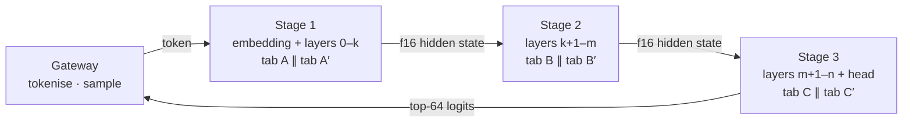

# Network inference

The most ambitious thing BRAIN does today: run a language model across browser tabs, with no single tab holding the whole model, and verify every step by agreement between two tabs. It is live in NETWORK mode on [/chat](https://brainnetwork.app/chat), it is free, and it reports its real token rate.

## The model

Qwen3 (Apache-2.0) in GGUF:

| Tier | Quantisation | Stages | When |
| --- | --- | --- | --- |
| 0.6B | Q8_0 | 3 | Small tier |
| 1.7B | Q4_0 | 4 | Default |
| 4B | Q4_0 | 6 | Once enough nodes hold stages |

## How the model is split

By layers. The first stage holds the embedding, the last holds the final norm and the tied output head and returns the top-64 logits. The gateway holds no weights: it tokenises, samples, and streams.

A tab downloads only the tensors for its own stage, by HTTP range requests to the Hugging Face CDN, and caches them. It runs them with Q4_0 / Q8_0 WebGPU kernels that were checked against a CPU reference to within 6×10⁻⁴ relative RMS (the harness is at `/dev/llm-check`). Each tab keeps a per-session f16 KV cache.

## How hidden states move

Tab to tab, as f16, over a persistent WebSocket relay implemented as a Cloudflare Durable Object. The gateway issues HMAC tickets so only the tabs assigned to a session can join its relay room. Every lap around the pipeline carries the next token plus up to four prompt-lookup draft tokens, verified in one pass with KV rollback, so output is identical to plain decoding but fewer laps are needed.

## How it is verified

Every stage of every lap runs on two nodes when two hold that stage. Hidden states must agree within 2×10⁻³ relative RMS; for the final stage at least 48 of the top-64 logit ids must match. Only fully checked, agreeing nodes receive verified units (`kind: inference`, spec `llm_stage`). A stage that ran without a replica is recorded as `no-replica` and earns nothing. This is the browser-network equivalent of a bit-exact spot-check: the answer is trusted because two independent machines produced it.

## What the receipt shows

Model actually run, nodes per stage, hops, drafted tokens, first-token time, tokens per second as measured. No charge. The mode is never mixed with upstream answers; if the relay is not configured the mode reports no capacity rather than falling back to anything.

## Why this matters for scale

This is the proof that the browser tier is not only for integer kernels. A tab with a 1 GB slice can hold one stage of a small model, and enough tabs holding enough stages serve inference end to end without any machine that BRAIN owns. The limits are real: latency is bounded by the slowest tab and the relay hop, and the model must be small enough that a stage fits in a browser buffer. The [Scale](../scale/the-shape-of-the-network.md) section covers what those limits mean as the network grows.
