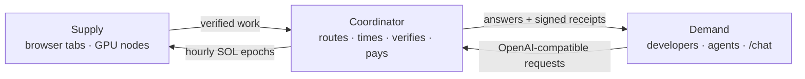

# What BRAIN is

BRAIN is a compute layer with three parties.

**Supply** is anyone with a computer. Two ways in: open [brainnetwork.app/earn](https://brainnetwork.app/earn) in a browser with WebGPU, or run the Brain Node agent on a machine with an NVIDIA card. Either way the machine is measured by the server, not by itself.

**Demand** is anyone who needs inference or parallel compute. The entry point is `https://brainnetwork.app/v1`, which speaks the OpenAI chat-completions protocol. Change one URL in an existing client and requests flow through BRAIN.

**The coordinator** sits between them. It is the only trusted party, and it is built to fail safe: a bug may cost availability, it may never award compute that did not happen. It routes each request with a published formula, times the work on its own clock, verifies what it can, signs a receipt, and settles an hourly pool of SOL to the wallets that did verified work.

## What makes it different from renting a GPU

A GPU rental gives you a machine. BRAIN gives you an answer and a receipt.

| Renting a GPU | Using BRAIN |
| --- | --- |
| You pick hardware | You pick a model or `brain/auto`; routing picks the hardware |
| You pay for time | You pay for the request, at a configured list price (or UNKNOWN when none is set) |
| You trust the host | The coordinator checks hashes, timing and consistency, re-runs a sample on a second machine, and tells you on the receipt exactly what was and was not verified |
| The provider owns the fleet | Nobody owns the fleet. The hardware belongs to the people running it |

## What makes it different from a token project

There is a token, and its trading fees are how contributors get paid. That is the whole role of the token in this system. There is no staking, no emissions schedule, no governance vote, no node licence, no points, no quests, no levels. Holding tokens with zero verified compute earns exactly zero, and that property is enforced by tests, not by policy.

## What is real today

* Browser nodes run real WebGPU kernels against server-seeded challenges and are verified bit-exactly. **LIVE.**
* GPU nodes serve open-weight models through vLLM; the coordinator times every token. **LIVE** on real hardware, with the first nodes benchmarked on 7 October 2026.
* The `/v1` gateway, the BRAIN AUTO router, signed receipts and the accounting ledger. **LIVE.**
* Hourly SOL settlement and wallet claims. **LIVE**; 11.10 SOL paid to contributors at the time of writing.
* Pipeline-sharded Qwen3 inference across browser tabs. **LIVE** in `/chat` NETWORK mode, free, labelled with its real token rate.
* Anchoring receipt batches on Solana, hardware attestation, full re-execution of every request. **PLANNED**, and nothing on the site says otherwise.

The rest of this book goes through each of these in detail.
